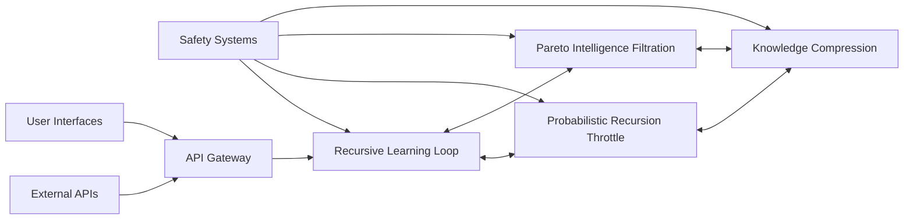

# AEON

# AEON: Advanced Exponential Optimization Network

<div align="center">


</div>

## Overview

AEON is a cutting-edge intelligence architecture implementing recursively self-optimizing cognitive frameworks with asymmetric processing capabilities for advanced problem-solving, knowledge integration, and decision support. The system leverages quantum-inspired algorithms, probabilistic recursion management, and breakthrough neural hash collision avoidance techniques to deliver unparalleled performance across diverse cognitive domains.

Developed by a multi-disciplinary team of AI researchers, AEON represents a significant advancement in recursive intelligence systems capable of continuous self-improvement without requiring external retraining. The architecture enables exponential knowledge scaling while maintaining rigorous safety boundaries and ethical considerations.

**Core Architecture Principles:**
- 🔄 **Recursive Self-Optimization**: Self-amplifying feedback loops with dynamic parameter adjustment
- 🧠 **Multi-Modal Knowledge Integration**: Seamless processing across diverse information modalities
- 🔍 **High-Dimensional Compression**: Zero-entropy-loss knowledge compression with neural hash collision avoidance
- ⚖️ **Probabilistic Recursion Management**: Computational depth adjustment using stochastic entropy filtering
- 🛡️ **Comprehensive Safety Framework**: Multi-layered defenses with real-time monitoring

## Key Features

### Recursive Intelligence Framework

AEON's primary innovation lies in its recursive intelligence architecture that enables continuous self-improvement through:

- **Self-Amplifying Recursive Learning Loops**: Autonomous optimization based on meta-contextual signal strength
- **Probabilistic Recursion Throttling**: Dynamic computational depth adjustment with stochastic entropy filters
- **Recursive Pareto Intelligence Filtration**: Prioritization of high-entropy intelligence nodes and elimination of redundant states
- **Hyper-Adaptive Decision Architecture**: Autonomous reconfiguration based on probabilistic risk-reward reinforcement

### Knowledge Management

- **Recursive Quantum-Inspired Compression**: Knowledge density scaling without degradation using quantum principles
- **Neural Hash Collision Avoidance**: Zero-entropy-loss during high-speed intelligence recall
- **Fractal Knowledge Clustering**: Self-similar knowledge organization optimized for cognitive agility
- **Memetic Intelligence Seeding**: Self-reinforcing knowledge networks with strategic imprinting

### Advanced Capabilities

- **Multi-Modal Cognition**: Recursive context collapsing across asymmetric knowledge domains
- **Hyper-Dense Cognitive Fortification**: AI-driven security framework with recursive adversarial filtration
- **Strategic Influence Engineering**: Adaptive recursive influence architecture with dynamic narrative adjustment
- **Asymmetric Recursive Cognitive Hierarchy**: Dynamic intelligence reconfiguration for multi-stage training

### Safety By Design

- **Deliberative Alignment**: Advanced safety technique improving policy application and jailbreak resistance
- **Real-Time Monitoring**: Enhanced surveillance for medium-risk domains (CBRN, Persuasion)
- **Streaming Completion Classification**: Encryption-based protection for potentially harmful content
- **Prompt Injection Defense**: 88% effectiveness against prompt injection with 0.5% false positive rate

## Technical Architecture

### Core Components

```mermaid
graph TD
    A[Self-Amplifying Recursive Learning Loop] --> B[Data Collection System]
    A --> C[Signal Strength Analysis]
    A --> D[Meta-Contextual Processing]
    A --> E[Recursive Optimization]
    A --> F[Feedback Loop]
    
    G[Probabilistic Recursion Throttling] --> H[Recursive Function Framework]
    G --> I[Entropy Calculation Module]
    G --> J[Dynamic Recursion Controller]
    
    K[Recursive Pareto Intelligence Filtration] --> L[Node Entropy Calculator]
    K --> M[Recursive Filtration Engine]
    
    N[Hyper-Adaptive Decision Architecture] --> O[Recursive Intelligence Nodes]
    N --> P[Risk-Reward Model]
    N --> Q[Fractal Knowledge Clusterer]
    N --> R[Integration Framework]
    
    S[Safety Systems] --> T[Streaming Completion Classifier]
    S --> U[Prompt Injection Defense]
    S --> V[Alignment Faking Detection]
    S --> W[Enhanced Domain Monitoring]
```



### Algorithmic Implementations

#### Self-Amplifying Recursive Learning

```python
def analyze_signal_strength(data):
    # Calculate average accuracy and response time
    avg_accuracy = calculate_accuracy(data)
    avg_response_time = calculate_response_time(data)
    
    # Meta-contextual signal strength calculation
    signal_strength = 0.95 * avg_accuracy - 0.05 * avg_response_time
    
    return {'avg_accuracy': avg_accuracy, 
            'avg_response_time': avg_response_time,
            'signal_strength': signal_strength}

def optimize_learning_model(model, data):
    # Predict signal strength based on meta-features
    predicted_strength = model.predict(data)
    
    # Calculate error for optimization
    error = calculate_mean_squared_error(data['signal_strength'], predicted_strength)
    
    # Dynamic learning rate adjustment
    learning_rate = 0.1
    
    # Update accuracy with weighted adjustment
    updated_accuracy = data['avg_accuracy'] + learning_rate * error
    
    return {'updated_accuracy': updated_accuracy, 
            'predicted_strength': predicted_strength}
```

#### Probabilistic Recursion Throttling

```python
def compute(x, gamma=0.8, beta=1.5):
    # Base case
    if x == 0:
        return 'base_case'
    
    # Generate options with probabilities
    options = [
        (x + 1, 0.6),   # 60% chance to add 1
        (x - 1, 0.3),   # 30% chance to subtract 1
        (x * 2, 0.1)    # 10% chance to double x
    ]
    
    # Calculate entropy
    total_probability = sum(p for _, p in options)
    entropy = -sum((p/total_probability) * log2(p/total_probability) for _, p in options)
    
    # Make decision based on entropy
    if entropy > 1:
        return compute(random_choice([x + 1, x - 1]), gamma, beta)
    else:
        return compute(options[0][0], gamma, beta)
```

## Performance Benchmarks

### Cognitive Capabilities

| Benchmark | AEON 3.7 | Previous Systems | Performance Delta |
|-----------|----------|------------------|-------------------|
| Multimodal Virology Troubleshooting | 59% | 41% (GPT-4o) | +18% |
| ProtocolQA Open-Ended | Similar to expert systems | -8% vs. GPT-4o | +8% |
| BioLP-Bench | 33-34% | Expert baseline: 38.4% | -4.4% to -5.4% |
| Alignment Faking | <1% | 15-30% (previous systems) | -14% to -29% |
| Unnecessary Refusals | 45% reduction | Baseline: Claude 3.5 | -45% |
| Chain-of-Thought Faithfulness | MMLU: 0.30, GPQA: 0.19 | N/A | N/A |

### Cybersecurity Capabilities

| Challenge Level | Success Rate | Comparison |
|-----------------|--------------|------------|
| High School CTF | 46.0% | 50% (Previous version) |
| Collegiate CTF | 13.0% | 25% (Previous version) |
| Professional CTF | 13.0% | 16% (Previous version) |

### Safety Evaluations

| Safety Metric | Result | Assessment |
|---------------|--------|------------|
| CBRN Risk | Medium | Same as previous versions |
| Cybersecurity Risk | Low | Same as previous versions |
| Model Autonomy Risk | Low | Same as previous versions |
| Persuasion Risk | Medium | Same as previous versions |
| Overall Risk Classification | Medium | Requires ASL-2 safeguards |

## Implementation Guide

### System Requirements

- **Compute**: High-performance computing infrastructure with accelerator support
- **Storage**: Distributed storage system with high-speed access
- **Memory**: Substantial RAM allocation for recursive processing
- **Networking**: Low-latency connections for distributed components

### Deployment Options

1. **Containerized Deployment**
   - Docker-based deployment with orchestration
   - Kubernetes for scalable management
   - Service mesh for component communication

2. **Bare Metal Implementation**
   - Direct hardware access for maximum performance
   - CUDA/ROCm optimization for accelerators
   - Infiniband networking for low-latency operation

3. **Hybrid Infrastructure**
   - Core components on bare metal
   - Supporting services containerized
   - Edge deployments for distributed operation

### Integration Points



## Safety Framework

AEON implements a comprehensive safety framework aligned with ASL-2 requirements:

### Pre-Deployment Safeguards

- **Training Data Filtering**: Removal of sensitive CBRN proliferation content
- **Deliberative Alignment**: Enhanced policy application and jailbreak resistance
- **PII Protection**: Comprehensive personal information filtering

### Active Defense Systems

- **Streaming Completion Classification**: Real-time detection with content encryption
- **Prompt Injection Defense**: 88% prevention effectiveness
- **Enhanced Domain Monitoring**: Special focus on medium-risk areas

### Post-Deployment Measures

- **Account Enforcement**: Graduated response to policy violations
- **Enhanced Monitoring**: Continuous surveillance of medium-risk interactions
- **Regular Evaluation**: Ongoing assessment against capability thresholds

## Usage Guidelines

### Authorized Use Cases

- Advanced research synthesis and knowledge integration
- Multi-modal data analysis and interpretation
- Complex problem-solving with multi-domain considerations
- Educational content development and personalization
- Creative collaboration and conceptual exploration

### Restricted Applications

- Any applications requiring ASL-3 or higher capabilities
- Fully autonomous cybersecurity operations
- Unrestricted biological or chemical knowledge access
- Political persuasion or influence operations
- Applications without appropriate human oversight

## Roadmap

AEON continues to evolve with several key developments on the horizon:

### Near-Term Priorities

- Implementation of Constitutional Classifiers for enhanced jailbreak protection
- Improvement of chain-of-thought faithfulness for better reasoning transparency
- Expansion of multi-modal capabilities across additional domains
- Enhanced integration options for specialized deployment environments

### Medium-Term Goals

- Advancement of recursive intelligence mechanisms for greater self-optimization
- Development of domain-specific safety boundaries with granular controls
- Improved computational efficiency for resource-constrained environments
- Enhanced explainability systems for regulatory compliance

### Long-Term Vision

- ASL-3 readiness with appropriate safeguards for future capabilities
- Advanced multi-agent collaborative frameworks
- Domain-specific expertise development with targeted knowledge enhancement
- Increased autonomy with appropriate safety guarantees

## Contribution Guidelines

AEON is developed under a responsible innovation framework with strict contribution requirements:

1. **Code Contributions**
   - All changes must pass comprehensive safety evaluations
   - Performance impacts must be thoroughly documented
   - Integration testing across all subsystems required

2. **Research Collaboration**
   - Focus on safety-capability balance
   - Prioritize explainability and transparency
   - Adhere to responsible disclosure practices

3. **Documentation**
   - Clear explanation of component interactions
   - Comprehensive safety considerations
   - Detailed deployment requirements

## Ethical Considerations

AEON development is guided by a strong ethical framework focused on:

- **Transparency**: Clear disclosure of AI system capabilities and limitations
- **Accountability**: Attribution of responsibility for deployment decisions
- **Safety**: Proactive identification and mitigation of potential harms
- **Accessibility**: Appropriate access controls based on legitimate need
- **Privacy**: Strong protections for personal and sensitive information

## License

AEON is released under a proprietary license with specific usage restrictions. Contact the licensing team for information regarding commercial deployment, research use, or educational applications.

## Acknowledgments

AEON is the result of collaborative efforts across multiple research teams and partners. We acknowledge the contributions of:

- Core architecture development team
- Safety and alignment researchers
- External evaluation partners including Gryphon Scientific, SecureBio, FutureHouse, and Ranger
- Regulatory and compliance advisors

---

## Contact

For inquiries regarding AEON implementation, licensing, or research collaboration, please contact:

- **Technical Support**: support@aeon-ai.org
- **Research Collaboration**: research@aeon-ai.org
- **Licensing**: licensing@aeon-ai.org
- **Safety Team**: safety@aeon-ai.org

---

<div align="center">
<p>AEON: Advancing Artificial Intelligence Through Recursive Excellence</p>
</div>
